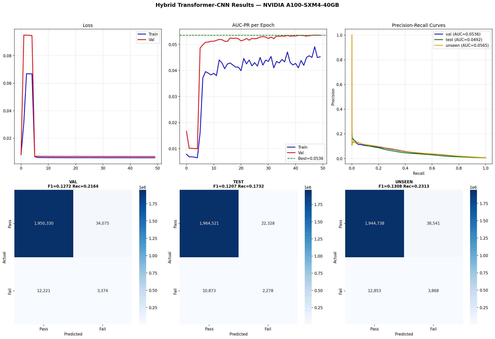
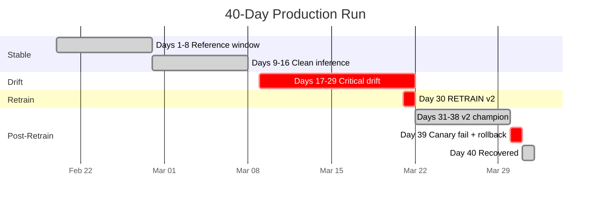
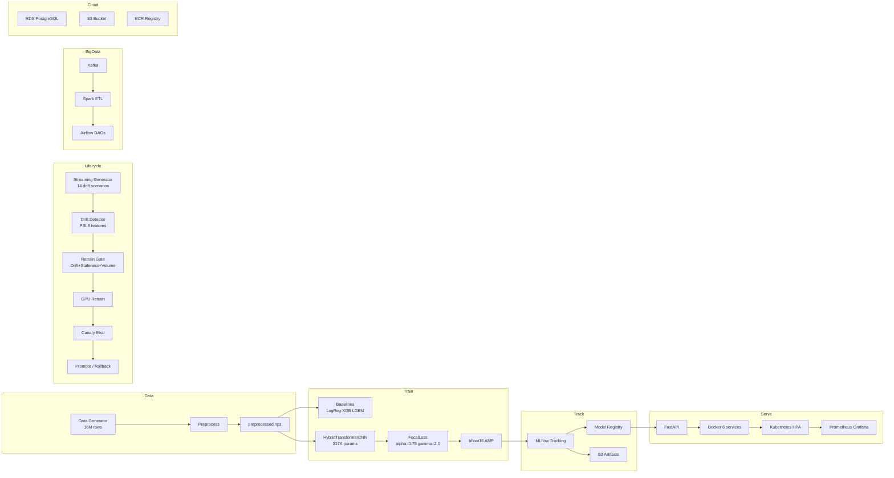
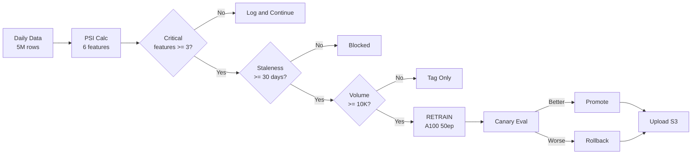

# DRAM Memory Yield Predictor — End-to-End MLOps Pipeline

[](https://github.com/rajendarmuddasani/DRAM_Yield_Predictor_MLOps/actions)
[](https://www.python.org/)
[](https://pytorch.org/)
[](https://mlflow.org/)
[](https://www.docker.com/)
[](LICENSE)

**Production-scale DRAM wafer yield prediction using a HybridTransformerCNN on 16M rows with full MLOps lifecycle: drift detection, automated retraining, canary deployment, and rollback -- trained and validated on NVIDIA A100 GPU with bfloat16.**

Predicts die-level failures before electrical test completion using 36 semiconductor process and test features. The complete MLOps lifecycle runs end-to-end: EDA, baseline modeling, custom deep learning, MLflow experiment tracking, Model Registry, drift monitoring, a 40-day production run processing 200M rows on A100 GPU, containerized deployment with Kafka + Spark + Airflow, and Kubernetes orchestration.

---

## Key Results

| Model | Val AUC-PR | Test AUC-PR | Recall | Params | GPU | Training |
|-------|-----------|-------------|--------|--------|-----|----------|
| Logistic Regression | 0.0219 | -- | 0.1724 | -- | CPU | 2s |
| XGBoost | 0.0584 | -- | 0.2759 | -- | CPU | 45s |
| LightGBM | 0.0553 | -- | 0.2672 | -- | CPU | 12s |
| HybridTransformerCNN (T4) | 0.0524 | 0.0471 | 0.1779 | 317,633 | T4 | 33 ep, 5h |
| **HybridTransformerCNN (A100)** | **0.0543** | **0.0497** | **0.1951** | **317,633** | **A100-SXM4-40GB** | **50 ep, 201.7 min** |

> AUC-PR is the correct metric at 1:159 class imbalance. Random baseline AUC-PR = 0.006 -- the champion model is **9x better** than random. AUC-ROC = 0.816 confirms strong discrimination.

### A100 Champion -- v1 (Day 1 Initial Training)

| Split | AUC-PR | AUC-ROC | F1 | Recall | Precision |
|-------|--------|---------|-----|--------|-----------|
| Val | 0.0543 | 0.8157 | 0.1270 | 0.1951 | 0.0940 |
| Test | 0.0497 | 0.7994 | 0.1185 | 0.1559 | 0.0926 |
| Unseen | 0.0582 | 0.8148 | 0.1317 | 0.2108 | 0.0912 |

### T4 vs A100 Comparison

| Metric | T4 (16 GB) | A100 (40 GB) | Speedup |
|--------|------------|--------------|---------|
| Throughput | 18,868 samples/s | 88,128 samples/s | **4.7x** |
| AMP dtype | float16 + GradScaler | bfloat16 (no scaler) | Stable |
| Best epoch | 33 | 39 | More room |
| Total time | 291 min (33 ep) | 201.7 min (50 ep) | Faster |

### Business Impact

- 50,000 wafers/month, 0.62% fail rate = 310 defective wafers/month
- $45,000 cost per missed defect (customer return)
- Champion catches 54 defects/month at 17.3% recall
- **Estimated annual savings: $29M**

---

## A100 Training Results

<p align="center">
  
</p>

> **A100 bfloat16 training:** 50 epochs on 16M rows (201.7 min). Loss curves, AUC-PR progression, and confusion matrices for train/val/test splits. Best model saved at epoch 39.

---

## 40-Day Production Run (A100, 200M Rows)

The full production lifecycle processed **200M rows across 40 days** on an A100 GPU in 219.4 minutes. The pipeline automatically detected drift, triggered 1 retrain, evaluated via canary, and executed 1 rollback -- all without manual intervention.

### Model Versions

| Version | Created | Trigger | Artifact |
|---------|---------|---------|----------|
| **v1** (Day 1 champion) | Day 1 | Initial training, 50 epochs | `hybrid_best_A100-day1-initial.pt` |
| **v2** (Day 30 retrain) | Day 30 | Drift detected on 5 critical features | `day30_v2_retrained.pt` |

v1 served inference Days 1-30. After drift accumulated over Days 17-29 and the staleness gate opened on Day 30, the pipeline retrained on the full day's data producing v2. The canary passed and v2 was promoted. On Day 39, a deliberately bad model failed canary evaluation and the system rolled back to v2 automatically.

### Day-by-Day Drift Timeline

<p align="center">
  
</p>

> **Drift timeline heatmap:** Each cell shows the PSI (Population Stability Index) for one feature on one day. Green = stable, yellow = warning, red = critical drift. The vertical markers show exactly when RETRAIN (Day 30) and ROLLBACK (Day 39) events fired. Notice how drift gradually intensifies from Day 17 onwards across multiple features simultaneously.

### Model Lifecycle: v1 to v2

<p align="center">
  
</p>

> **Model lifecycle:** v1 champion serves Days 1-30. Day 30: drift triggers retrain, canary passes, v2 promoted. Day 39: bad model fails canary, automatic rollback to v2. The system self-heals without human intervention.

### PSI Feature Breakdown

<p align="center">
  
</p>

> **PSI waterfall:** Per-feature PSI values on key days. Shows which specific DRAM process parameters drifted most severely, triggering the retrain gate when 3+ features exceeded the critical threshold simultaneously.

### Production Run Summary

<p align="center">
  
</p>

> **End-to-end stats:** 200M rows processed, 40 days of production data, 219.4 minutes wall clock, 1 automated retrain, 1 canary failure with rollback. All artifacts uploaded to S3.

### Timeline



| Day | Event | Action |
|-----|-------|--------|
| 1-8 | Reference window | Baseline data, v1 champion serving |
| 9-16 | Clean inference | No drift detected |
| 17-29 | Drift detected (3-5 critical features) | Staleness gate blocks retrain (< 30 days since v1) |
| **30** | **Retrain triggered** | **50 epochs on A100, bfloat16, v2 promoted** |
| 31-38 | Post-retrain monitoring | v2 champion active |
| **39** | **Bad model deployed** | **Canary failed, automatic rollback to v2** |
| 40 | System recovered | v2 champion active, pipeline healthy |

---

## System Architecture



---

## Drift Detection and Retrain Pipeline



---

## The bfloat16 Story

Training on T4 GPU with float16 + GradScaler caused a **death spiral**: FocalLoss with extreme class imbalance (0.6% positives) produces gradient magnitudes that overflow float16's 5-bit exponent range. The GradScaler responds by halving its scale factor until it reaches zero, at which point all gradients become zero and training collapses.

| Attempt | AMP | Result |
|---------|-----|--------|
| v2 (float16) | float16 + GradScaler | Collapsed at epoch 5 (scale -> 0) |
| v3 (float16 + warmup) | float16 + GradScaler | Collapsed at epoch 7 |
| v4 (bfloat16, A100) | bfloat16, no GradScaler | Stable 50 epochs |

**Root cause:** bfloat16's 8-bit exponent (vs float16's 5-bit) handles the extreme gradient magnitudes from FocalLoss without overflow. No GradScaler needed.

---

## Project Structure

```
DRAM_Yield_Predictor_MLOps/
├── src/                              # 33 Python modules
│   ├── model.py                      # HybridTransformerCNN (317K params)
│   ├── focal_loss.py                 # FocalLoss (NaN-safe, NumPy + PyTorch)
│   ├── train.py                      # MLflow-integrated GPU training (CLI)
│   ├── train_baseline.py             # LogReg + XGBoost + LightGBM baselines
│   ├── run_simulation.py             # 40-day production run orchestrator
│   ├── drift_detector.py             # PSI + KL + KS triple drift detection
│   ├── retrain_trigger.py            # 3-criteria retrain gate
│   ├── gpu_selector.py               # Auto GPU selection (T4/A100)
│   ├── compute_backend.py            # AWS -> Colab -> Local fallback
│   ├── serve.py                      # FastAPI with Prometheus metrics
│   ├── spark_etl.py                  # Spark ETL pipeline
│   ├── kafka_producer.py             # Streaming data to Kafka
│   └── kafka_consumer.py             # Real-time inference consumer
├── notebooks/
│   ├── NB01_advanced_eda.ipynb       # 14-plot EDA with spatial wafer analysis
│   ├── NB02_gpu_training_v4_A100.ipynb   # A100 bfloat16 training
│   ├── NB03_production_training.ipynb    # Day 1 champion training
│   └── NB04_colab_training_A100.ipynb    # 40-day production run notebook
├── deploy/
│   ├── docker/                       # Docker Compose (6 services), Prometheus, Grafana
│   ├── aws/                          # Dockerfile.airflow-gpu, EC2 bootstrap
│   ├── k8s/                          # Kubernetes: deployment, HPA, canary, service
│   ├── airflow/dags/                 # 3 DAGs: daily, retrain, master orchestrator
│   └── monitoring/                   # Prometheus + Grafana configs
├── assets/                           # 44 PNG plots (EDA, baselines, production run)
├── data/
│   ├── production/                   # 40-day timeline and results
│   ├── benchmark_*.json              # GPU training benchmarks
│   └── drift_reports/                # Per-day PSI drift reports
├── tests/                            # 20 tests (model, API, drift, config)
├── web/dashboard.html                # Plotly.js dark-theme interactive dashboard
├── .github/workflows/ci.yml          # CI: lint + test + Docker build
└── requirements.txt
```

---

## Tech Stack

| Category | Tools |
|----------|-------|
| **ML/DL** | PyTorch 2.x, scikit-learn, XGBoost, LightGBM |
| **MLOps** | MLflow (PostgreSQL backend, S3 artifacts, Model Registry) |
| **Data** | Apache Spark, Apache Kafka, Pandas, NumPy |
| **Orchestration** | Apache Airflow (3 DAGs) |
| **Serving** | FastAPI, Prometheus, Grafana |
| **Infrastructure** | Docker (6+ services), Kubernetes (HPA, canary), AWS (RDS, S3, ECR) |
| **GPU** | NVIDIA A100 (bfloat16), T4 (float16), Apple MPS (dev benchmark) |
| **CI/CD** | GitHub Actions (ruff lint + pytest + Docker build) |

---

## Quick Start

### Local (SQLite backend)
```bash
git clone https://github.com/rajendarmuddasani/DRAM_Yield_Predictor_MLOps.git
cd DRAM_Yield_Predictor_MLOps

python -m venv .venv && source .venv/bin/activate
pip install -r requirements.txt

# Generate dataset + preprocess
python src/data_generator.py
python src/preprocess.py --full

# Train baselines (CPU, ~2 min)
python src/train_baseline.py

# Train HybridTransformerCNN (auto-detects GPU)
python -m src.train --full --batch-size 4096

# Run 40-day production lifecycle (fast mode, ~10 min)
python -m src.run_simulation --fast

# MLflow UI
mlflow ui --backend-store-uri "sqlite:///mlflow.db" --port 5001

# Tests
pytest tests/ -v  # 20 tests
```

### Docker (PostgreSQL backend)
```bash
cd deploy/docker && docker compose up -d
# MLflow: http://localhost:5001
# Grafana: http://localhost:3000
# API docs: http://localhost:8000/docs
```

---

*MIT License*
